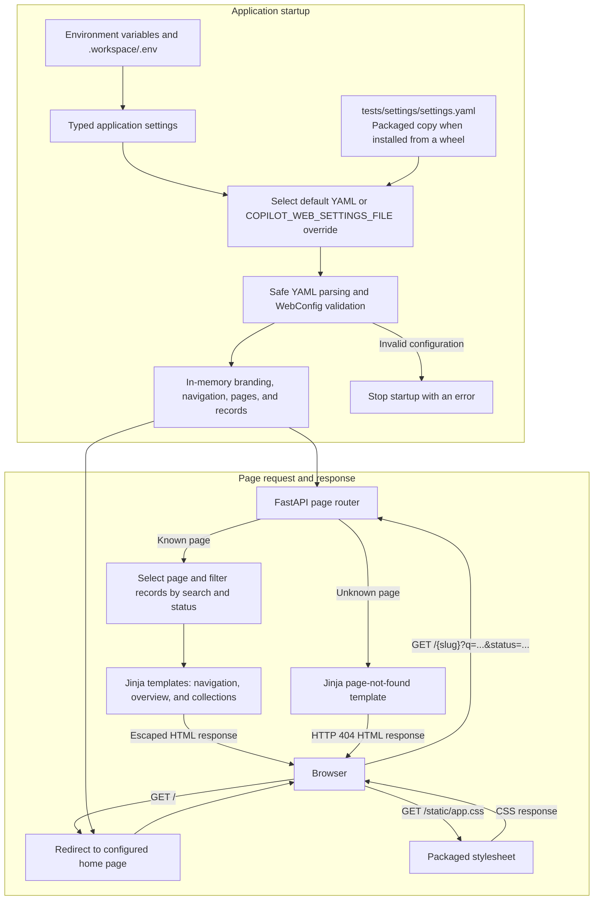

# AI Delivery Copilot

AI Delivery Copilot is a project-intelligence layer that keeps Jira requirements, GitHub implementation activity, engineering findings, and human decisions aligned.

The product helps developers understand the intent and boundaries of their work and helps managers see material implementation changes, risks, and decisions backed by source evidence. Jira and GitHub remain the systems of record.

## Project status

The project is in **Phase 0 — Foundation**. A YAML-configured, multi-page web preview is implemented; the core domain model and persistence layer are next.

## MVP workflow

```text
Jira issue
  -> generated implementation brief
  -> human-accepted baseline
  -> linked GitHub pull request
  -> confirmed engineering findings
  -> requirement/implementation comparison
  -> human decision
  -> versioned baseline
```

Generated content is always reviewable. The system must distinguish source facts from inference, preserve provenance, and require human acceptance before changing an approved baseline.

## Current web app data flow

The preview loads page configuration at startup and serves read-only sample data.
Jira ingestion, GitHub ingestion, and database persistence are future milestones.



Search and status filters operate on the loaded records without changing the YAML.
Expandable details work in the browser. Restart the app after editing configuration;
see [web configuration](docs/web-configuration.md) for the schema and examples.

## Technology direction

The MVP will be a Python-first modular monolith:

- Python and FastAPI for the application and HTTP interface;
- PostgreSQL for durable relational storage;
- SQLAlchemy and Alembic for persistence and migrations;
- Jinja templates, HTMX, and minimal JavaScript for the web interface;
- `httpx`-based adapters for Jira, GitHub, and model providers;
- database-backed background work initially, with no required message broker;
- pytest, Ruff, and mypy for automated verification;
- `uv` for Python dependency and environment management;
- Docker Compose for optional local infrastructure.

See [`.build/TECH_STACK.md`](.build/TECH_STACK.md) for requirements and boundaries. Application dependencies are locked in `uv.lock`; remaining stack components will be added as their milestones begin.

## Repository guide

The [`.build`](.build/README.md) directory is the project control plane:

- [`instruction.md`](.build/instruction.md) — durable product and engineering rules;
- [`ROADMAP.md`](.build/ROADMAP.md) — ordered phases, deliverables, and status;
- [`DECISIONS.md`](.build/DECISIONS.md) — accepted choices and rationale;
- [`THOUGHTS.md`](.build/THOUGHTS.md) — unresolved ideas, assumptions, and risks.

Application code lives under `ai_copilot/`, tests under `tests/`, with database migrations planned under `migrations/` and operational documentation under `docs/`.

## Local development

Install Python 3.14 and `uv`, then run from the repository root:

```bash
uv sync --locked
uv run uvicorn ai_copilot.main:create_app --factory --reload --host 127.0.0.1
```

Open <http://127.0.0.1:8000/> for the web app or <http://127.0.0.1:8000/docs> for API documentation. Verify liveness with
`curl http://127.0.0.1:8000/health`, which returns `{"status":"ok"}`.
The skeleton runs without PostgreSQL or provider credentials. This endpoint
checks process liveness only; it does not check database readiness.

Settings load from `.workspace/.env` relative to the current working directory,
with environment variables taking precedence. `COPILOT_DEBUG` defaults to `false`;
invalid boolean values prevent startup. No environment file is required.

Run the quality checks:

```bash
uv run pytest
uv run mypy
uv run ruff check .
uv run ruff format --check .
```

The web app includes Overview, Requirements, Implementation, and Decisions pages
with sample content, search, status filters, and expandable details. Configure its
branding, navigation, and pages in [`tests/settings/settings.yaml`](tests/settings/settings.yaml),
then restart the app. Set `COPILOT_WEB_SETTINGS_FILE` to use another YAML file.
This is a read-only preview; ingestion and approval workflows remain upcoming.
See [web configuration](docs/web-configuration.md) for the schema and examples,
and [application boundaries](ai_copilot/README.md) for the package layout.

Store local environment files in `.workspace/` and API keys or credential files in `.workspace/keys/`. The entire directory is ignored by Git. Keep only placeholder values in the tracked `.env.example`. Never commit credentials, access tokens, imported customer data, or generated model traces containing private content.

### Local database

Install Docker Engine with the Compose plugin, or Docker Desktop. Start PostgreSQL with:

```bash
mkdir -p .workspace/keys
cp -n .env.example .workspace/.env
chmod 700 .workspace .workspace/keys
chmod 600 .workspace/.env
docker compose --env-file .workspace/.env up -d --wait db
```

Skip the copy if you already have a `.workspace/.env`. The example credentials are for local development only. PostgreSQL is available at `127.0.0.1:5432`, with database `ai_delivery_copilot` and user `copilot`. Set `POSTGRES_PORT` in `.workspace/.env` if port 5432 is already in use. Application code running locally will use this host and port; a future application container will use `db:5432`.

```bash
docker compose --env-file .workspace/.env ps
docker compose --env-file .workspace/.env exec db sh -c 'psql -U "$POSTGRES_USER" -d "$POSTGRES_DB"'
docker compose --env-file .workspace/.env down
```

The named volume retains database data when containers stop or are removed. Credentials and database settings initialize an empty volume only; editing `.workspace/.env` does not update an existing database. `docker compose --env-file .workspace/.env down --volumes` deletes the local database permanently.

The setup uses the [official PostgreSQL image](https://hub.docker.com/_/postgres), pinned to major version 18, with its data volume mounted at `/var/lib/postgresql`.

## Contributing

Before changing the project, read the build-control documents and work from the earliest incomplete roadmap milestone. Behavior changes require tests, durable decisions belong in the decision log, and unapproved ideas belong in the thoughts queue.

Install pre-commit and enable the hooks once per clone:

```bash
uv tool install pre-commit
pre-commit install
pre-commit run --all-files
```

The pinned hooks in `.pre-commit-config.yaml` check whitespace, file endings, YAML/JSON/TOML syntax, merge conflicts, large files, and private keys. Ruff automatically fixes lint issues where possible and formats Python files. Markdown hard line breaks are preserved. Review and stage any automatic fixes before retrying a commit. The first run downloads the hook environments and requires network access.

### Continuous integration

The GitHub Actions workflow in `.github/workflows/ci.yaml` runs on pull requests, pushes to `main`, and manual dispatch. It runs pre-commit against all tracked files using Python 3.14 and validates Docker Compose using `.env.example`. No repository secrets are required. Hook fixes fail the check so contributors can review and commit them locally.

CI also builds the Python distribution with uv, installs the wheel, and verifies that `ai_copilot` imports from outside the checkout. A separate job installs locked dependencies and runs pytest, mypy, and Ruff. Database integration tests will be added with persistence.

## License

No open-source license has been selected. Until one is added, the repository should be treated as all rights reserved.
